# Improve your multi-module app build config with convention plugins
Satyan Jacquens - developer @Mojo

---
# A multi-module architecture
### Why should I use a multi-module application ?

- Part of the Google's Guide to app architecture
- Reduces the build time:
    - api/impl modules pattern (compilation avoidance)
    - Only use the necessary plugins in your module (android plugins are expensive)
    - Gradle modules parallel compilation
- Create several apps (demo apps, free vs pro, white-labelling, etc)
- ~~Square/Slack/Twitter is doing it~~
---

# A multi-module architecture
<style>
    img[alt~="center"] {
        display: block;
        margin: 0 auto;
    }
</style>


---
# A multi-module architecture
### Drawbacks
- Each module has its own gradle configuration file (`build.gradle`)
- `com.android.library` and `com.android.applications` plugins should be configured the same way for each modules
- Feature modules are all configured the same way (with extra dependencies and plugins)
- **⌘+C, ⌘+V** 🙈

⏭️ Let's fix this

---
## Simplify our modules build configurations files

Let's take for example an implementation data module (`data:game:impl`).

Here's the target `build.gradle.kts`:

``` kotlin
plugins {
    id("fr.sjcqs.android.lib")
    id("com.squareup.sqldelight")
}

dependencies {
    implementation(platform(libs.firebase.bom))
    implementation(libs.firebase.database)
    implementation(libs.kotlin.coroutines.playServices)

    implementation(libs.sqldelight.coroutines)

    implementation(projects.data.game.public)
}
```

⏭️ Let's start by sharing our dependencies

---
## Sharing dependencies and versions with a Gradle version catalog
⭐️ Having a single source of truth for the dependencies and plugins

You can create a version catalog file in `gradle/libs.versions.toml`
```toml
[versions]
coroutines = "1.6.0"
sqldelight = "1.5.3"
// ...

[libraries]
// ...
firebase-bom = "com.google.firebase:firebase-bom:29.0.4"
firebase-database = { module = "com.google.firebase:firebase-database-ktx" }
// ...
kotlin-coroutines-playServices = { module = "org.jetbrains.kotlinx:kotlinx-coroutines-play-services", version.ref = "coroutines" }
// ...
sqldelight-coroutines = { module = "com.squareup.sqldelight:coroutines-extensions-jvm", version.ref = "sqldelight" }
```
A `libs` property will be accessible from all your modules build configuration.

- `libs.<library>` to get a dependency
- `libs.versions.<version>` to get a version

⏭️ Let's create our conventions plugins and included them in our app

---
## Creating the `plugins` project
Alongside our app, let's create our `plugins` project with a `settings.gradle` file

```kotlin
dependencyResolutionManagement {
    repositories {
        google()
        gradlePluginPortal()
        mavenCentral()
    }
}
// Sharing the root project version catalog
versionCatalogs {
    create("libs") {
        from(files("../gradle/libs.versions.toml"))
    }
}
```

---
## Creating the `plugins` project
We will to use the unsafe API to access the version catalog from the plugins code.
``` kotlin
/**
* Usage: libs["<library>']
*/
internal val Project.libs: VersionCatalog
    get() = extensions.getByType<VersionCatalogsExtension>().named("libs")

internal operator fun VersionCatalog.get(name: String): Provider<MinimalExternalModuleDependency> {
    val optionalDependency = findLibrary(name)
    if (optionalDependency.isEmpty) {
        error("$name is not a valid dependency, check your version catalog")
    }
    return optionalDependency.get()
}

internal fun VersionCatalog.requireVersion(alias: String): String {
    val optionalVersion = findVersion(alias)
    if (optionalVersion.isEmpty) {
        error("$alias is not a valid version, check your version catalog")
    }
    return optionalVersion.get().toString()
}
```

---
## Adding the plugins dependencies

In our plugins, `build.gradle.kts`:
Define the plugins that will be used in our app as `compileOnly` dependencies.

```kotlin
dependencies {
    compileOnly(libs.kotlin.gradle) // org.jetbrains.kotlin:kotlin-gradle-plugin

    compileOnly(libs.android.gradle) // com.android.tools.build:gradle
    compileOnly(libs.hilt.gradle) // com.google.dagger:hilt-android-gradle-plugin
}
```

---
## Register the conventions plugins

In our plugins, `build.gradle.kts`:
```kotlin
plugins {
    id("java-gradle-plugin")
}

dependencies { ... }

// java-gradle-plugin
gradlePlugin {
    plugins {
        register("fr.sjcqs.android.lib") {
            id = "fr.sjcqs.android.lib"
            implementationClass = "fr.sjcqs.AndroidLibPlugin"
        }
    }
}
```
---
## Include the plugins build in our root project
In our root project `settings.gradle.kts`:
```kotlin
includeBuild("plugins")
```

Plugins will be compiled and accessible in our app's modules build configuration.

> _Note:_ They can also be published and provided throught a Maven repository

⏭️ Now let's write our convention plugin

---
## Writing a convention plugin

Regardless of the language we are using in our `build.gradle(.kts)` files (Kotlin or Groovy), we can write Gradle plugins in Groovy, Java or Kotlin.

The syntax is similar to the one we would use in a `build.gradle` file.

---
## Writing a convention plugin
### Creating the convention plugin class
```kotlin
package fr.sjcqs

import org.gradle.api.Plugin
import org.gradle.api.Project

class AndroidLibPlugin : Plugin<Project> {
    override fun apply(target: Project) {
        // configuration ...
    }
}
```

---
## Writing a convention plugin
### Applying plugins on the target project
```kotlin
package fr.sjcqs

import org.gradle.api.Plugin
import org.gradle.api.Project
import org.gradle.kotlin.dsl.apply

class AndroidLibPlugin : Plugin<Project> {
    override fun apply(target: Project) {
        with(target) {
            with(pluginManager) {
                apply("com.android.library")
                apply("kotlin-android")
            }
            // ...
        }
    }
}
```

---
## Writing a convention plugin
### Configure the Android extension
```kotlin
class AndroidLibPlugin : Plugin<Project> {
    override fun apply(target: Project) {
        with(target) {
            extensions.configure<LibraryExtension> {
                configureAndroidAndKotlin(this)
                // Config is a shared object
                defaultConfig.targetSdk = Config.android.targetSdk
                buildTypes {
                    all { isMinifyEnabled = false }
                }
            }
        }
    }
}
```

---
## Writing a convention plugin
### Configure the Android extension
```kotlin
internal fun Project.configureAndroidAndKotlin(extension: CommonExtension<*, *, *, *>) {
    with(extension) {
        compileSdk = Config.android.compileSdkVersion
        defaultConfig {
            minSdk = Config.android.minSdk
            testInstrumentationRunner = "androidx.test.runner.AndroidJUnitRunner"
        }
        buildTypes {
            getByName("debug") {
                isMinifyEnabled = false
                matchingFallbacks.add("release")
            }

            getByName("release") {
                isMinifyEnabled = true
                proguardFiles(getDefaultProguardFile("proguard-android-optimize.txt"),"proguard-rules.pro")
            }
        }
        compileOptions {
            sourceCompatibility = Config.jvm.javaVersion
            targetCompatibility = Config.jvm.javaVersion

            isCoreLibraryDesugaringEnabled = true
        }
        kotlinOptions {
            jvmTarget = Config.jvm.kotlinJvm
            freeCompilerArgs = freeCompilerArgs + Config.jvm.freeCompilerArgs
        }
        packagingOptions.resources.excludes += "/META-INF/{AL2.0,LGPL2.1}"
    }

    dependencies.apply {
        add("coreLibraryDesugaring", libs["desugarJdk"])
    }
}


private fun CommonExtension<*, *, *, *>.kotlinOptions(block: KotlinJvmOptions.() -> Unit) {
    (this as ExtensionAware).extensions.configure("kotlinOptions", block)
}
```

---
## Writing a convention plugin
### Adding the dependencies
```kotlin
class AndroidLibPlugin : Plugin<Project> {
    override fun apply(target: Project) {
        // ...
        // We don't have access to extensions like `implementation` and `compileOnly`
        dependencies {
            add("implementation", project(":tools:annotations"))

            add("compileOnly", libs["javaxInject"])

            add("implementation", libs["kotlin.stdlib"])
        }
    }
}
``

---
## Usage
```kotlin
plugins {
    id("fr.sjcqs.android.lib")  // ⬅️
    id("com.squareup.sqldelight")
}

dependencies {
    implementation(platform(libs.firebase.bom))
    implementation(libs.firebase.database)
    implementation(libs.kotlin.coroutines.playServices)

    implementation(libs.sqldelight.coroutines)

    implementation(projects.data.game.public)
}
```

---
## Writing a convention plugin
### Reusing a convention plugin

We can reuse our convention plugin in another one.

```kotlin
package fr.sjcqs

import extensions.get
import extensions.libs
import org.gradle.api.Plugin
import org.gradle.api.Project

class AndroidFeaturePlugin : Plugin<Project> {
    override fun apply(target: Project) {
        with(target) {
            pluginManager.apply {
                apply(AndroidLibPlugin::class.java)
            }
        }
        // ...
    }
}
```
⏭️ Some gotchas and further thoughts

---
## Gotchas & further thoughts
### Gradle scripts
It's possible to write gradle script in `src/main/java/<plugin-id>.build.gradle.kts`, Gradle will generate a plugin whose id is `<plugin-id>`

Don't do this ([#39](https://github.com/android/nowinandroid/issues/39) on [android/nowinandroid](https://github.com/android/nowinandroid))

|                      | scripts plugins | code plugins |
|:--------------------:|:---------------:|--------------|
| Configuring Projects |     12.724s     | 0.765s       |
|   Total Build Time   |     25.373s     | 11.205s      |
---
## Gotchas & further thoughts
### Dependencies (~interface segregation principle)

Limit the number of dependencies (and plugins) declared in your conventions plugins.

---
## Gotchas & further thoughts
### Further thoughts

1. You could publish those plugins to an internal maven repository, it should also improve configuration and build time. (using binary vs compilation)

    But it comes at a few costs:
    - Setup your CI to publish those plugins
    - Version the plugins
    - Switching between the internal repository and the included build when working on the build config

2. Conventions plugins can be used in any Gradle multi-module projects (not just Android apps)

---
## Gotchas & further thoughts
### Notes

You don't have to follow this talk to the letter

- Speak with your team:
- How many modules do you have ?
- Is build configuration a pain point ?
- Would you be able to maintain those plugins ? (and teach how ?)
- _I'm not perfect nor an expert on the subject. There might be things that could be done in a better way._

⏭️ Finally some references and peoples to follow

---
## References

Those references should not be blindly followed. Some of them are from people working in large companies with multiples people working on a single app and even people dedicated to build configuration.

Be pragmatic, keep the scale of your app and your team in mind, take only what you need.

~~Don't be a fanboy 🤩~~

---
## References
1. Herding elephants 🐘
    Some feedbacks and best practices on the Android's build configuration by [Tony Robalik](https://twitter.com/autonomousapps) who is working on build and tooling at Square
    🔗 https://developer.squareup.com/blog/herding-elephants/

2. Slack gradle plugins 👀
    Slack [started open sourcing](https://slack.engineering/developing-in-the-open/) part of their build tools on Github.
    🔗 https://github.com/slackhq/slack-gradle-plugin

3. Improve Build Times in Less Time by Zac Sweers, Slack 🎬
    [A talk from Android Makers 2022](https://www.youtube.com/watch?v=CkKtCuqqxHs) with some best practices to improve build time.

4. Now in Android project 📱
    🔗 https://github.com/android/nowinandroid

---
## Any Questions ❓

## Feedbacks 👂


🐦 [@sjcqs](https://twitter.com/sjcqs) (_feel free to reach out_)
